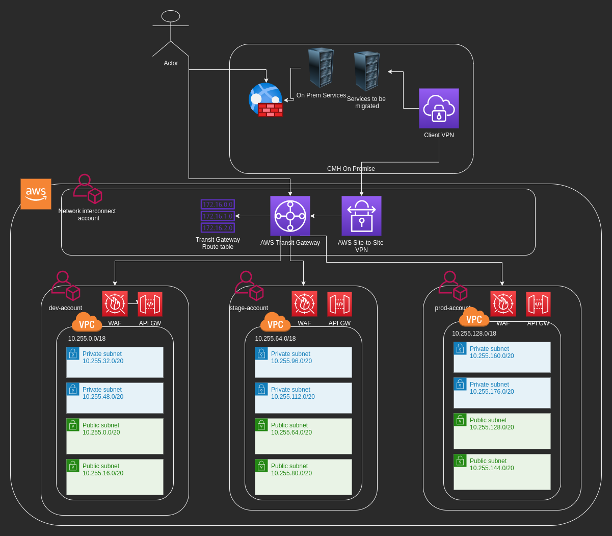

## Overview

This Terraform Script will show us how to configure and share a VPN accross multiple accounts, also this script needs be applied from localhost/workstation and not to be part of a CI/CD pipeline. (**ONE TIME SCRIPT**)

You'll find a folder named `envs` that contains the values for our environments.

### Pre-Requisites

* VPCs, private subnets and route tables created on each account that will be connected to the VPN.
* Subnets and route tables needs a tag that will be used to filter the subnets and route tables attached to the VPN.
* Deployment user with programatic access created at the Root account with `AWSAdministratorAccess`.
* AssumeRole policy created at Root account and assigned to the Deployment User.
```
Assume Role Policy applied on Deployment User
{
    "Version": "2012-10-17",
    "Statement": {
        "Effect": "Allow",
        "Action": "sts:AssumeRole",
        "Resource": "*"
    }
}

```
* Deployment Role with `AdministratorAccess` and a Trust Relationship with the Deployment User created at Root account. This Deployment role have to be created in every Account that will be attached to the VPN.
```
Trust Relationship
{
  "Version": "2012-10-17",
  "Statement": [
    {
      "Effect": "Allow",
      "Principal": {
        "AWS": "arn:aws:iam::XXXXXXXXX:user/deployment-user"
      },
      "Action": "sts:AssumeRole",
      "Condition": {}
    }
  ]
}
```
* An S3 bucket on each account involved in the VPN creation to store the terraform state file.


***
#### NOTE
Before apply this terraform script Log In to your master account and go to `Resource Access Manager` --> `Settings` and enable sharing with AWS Organizations
***
## Blueprint



## Environment Variables

The credentials requested belogs to the user `project-deploy-user`  created at the master  account `XXXXXXXXXXX` with permissions to assume a deployment role called `project-deploy-role` accross the other accounts.

| Name | Value | Description |
|------|---------|--------|
|AWS_ACCESS_KEY_ID| n/a | n/a |
|AWS_SECRET_ACCESS_KEY| n/a | n/a |
|AWS_REGION | ca-central-1| n/a |
| PARENT_ID | r-xx88 | Master Account Organization Unit ID |
| ACCOUNT_ID_IC | XXXXXXXX | Interconnect's Account ID  |
| DEPLOYMENT_ROLE | project-deploy-role | Role that has to be created in each account that will be added to the VPN Connection |
| PROFILE_IC | project-role-ic | Interconnect Profile Name  |
| PROFILE_BASE | project-role- | Base name for the different profile accounts |
| SOURCE_PROFILE | project | Profile name for the base or initial Profile used to create the others profiles |
| BUCKET_NAME | project-vpn-terraform-state | Bucket name where the Terraform state file will be stored on the Interconnect account|
| STATE_FILE_PATH  | vpn-state.tfstate | Terraform state file name stored at the S3 Bucket |
| BUCKET_NAME_BASE | project-vpc-terraform-state | Bucket name where the Terraform state file will be stored on the environment accounts |
|ACCOUNTS|( ["dev"]="XXXXXXX" ["stage"]="XXXXX" ["prod"]="XXXXXX" )| Accounts that will be attached to the transit Gateway |


## Requirements


| Name | Version |
|------|---------|
| Terraform | 1.0 |
| awscli | aws-cli/1.19.76 |
| jq | jq-1.6 |

## Providers

| Name | Version |
|------|---------|
| aws | n/a |

## Modules

| Name | Source | Version |
|------|--------|---------|
| vpc | terraform-aws-modules/vpc/aws | n/a |

## Resources

| Name | Type |
|------|------|
| [aws_customer_gateway.customer-gateway](https://registry.terraform.io/providers/hashicorp/aws/latest/docs/resources/customer_gateway) | resource |
| [aws_ec2_transit_gateway.transit-gateway](https://registry.terraform.io/providers/hashicorp/aws/latest/docs/resources/ec2_transit_gateway) | resource |
| [aws_ec2_transit_gateway_vpc_attachment.attachment-vpc](https://registry.terraform.io/providers/hashicorp/aws/latest/docs/resources/ec2_transit_gateway_vpc_attachment) | resource |
| [aws_ram_principal_association.association](https://registry.terraform.io/providers/hashicorp/aws/latest/docs/resources/ram_principal_association) | resource |
| [aws_ram_resource_association.example](https://registry.terraform.io/providers/hashicorp/aws/latest/docs/resources/ram_resource_association) | resource |
| [aws_ram_resource_share.shared](https://registry.terraform.io/providers/hashicorp/aws/latest/docs/resources/ram_resource_share) | resource |
| [aws_vpn_connection.example](https://registry.terraform.io/providers/hashicorp/aws/latest/docs/resources/vpn_connection) | resource |
| [aws_organizations_organization.org](https://registry.terraform.io/providers/hashicorp/aws/latest/docs/data-sources/organizations_organization) | data source |
| [aws_subnet_ids.subnets](https://registry.terraform.io/providers/hashicorp/aws/latest/docs/data-sources/subnet_ids) | data source |

## Inputs

| Name | Description | Type | Default | Required |
|------|-------------|------|---------|:--------:|
| ou_list | n/a | `list` | `[]` | yes |
| region| n/a | `string` | `"ca-central-1"` | yes |
| vpc_id | n/a | `string` | `"vpc-XXXXXXX"` | yes |

## Outputs

| Name | Description |
|------|-------------|
| org | n/a |


## Execution Steps

* Initialize the Environment Variables

```
export AWS_ACCESS_KEY_ID="XXXXXXXXXXXXXXXXXXXXXXXXXXX"
export AWS_SECRET_ACCESS_KEY="YYYYYYYYYYYYYYYYYYYYYYYYY"
export AWS_REGION=ca-central-1
export PARENT_ID=r-XXXX
export ACCOUNT_ID_IC=XXXXXXX
declare -A ACCOUNTS
export ACCOUNTS=(["dev"]="XXXXXXX" ["stage"]="XXXXX" ["prod"]="XXXXXX" )
```

The `terraform_exec.sh` script receives one parameter that indicates the action to be executed.

```
0 = Executes a terraform plan
1 = Executes a terraform apply
2 = Executes a terraform destroy
```


* Execute a Terraform Plan on the project folder

```
terraform_exec.sh 0
```

* Execute a Terraform apply on the project folder

```
terraform_exec.sh 1
```

* Execute a Terraform Destroy on the project folder

```
terraform_exec.sh 2
```